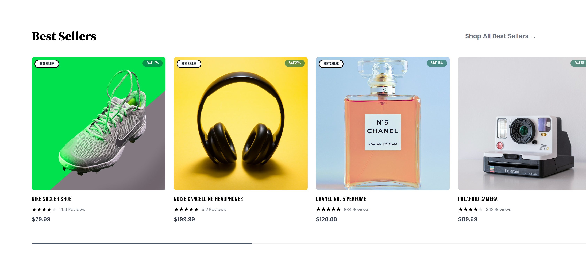
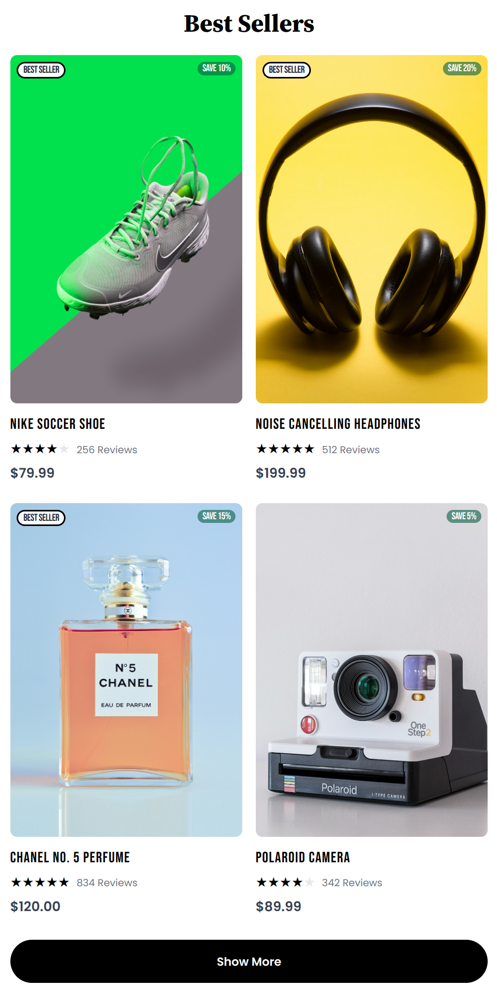

# Vanilla JS Product Section

This project shows how to develop a reusable, customizable UI component system, much like a UI framework, utilizing a vanilla JavaScript implementation with HTML and Tailwind CSS. This method gives UI components a single source of truth, making modification simple and application branding consistent.

## Helpers

### createElement Utility

The `createElement` utility function is used to create DOM elements with specific children and properties. The code becomes clearer and easier to maintain by abstracting away the repetitious processes of setting attributes, adding children, and creating event listeners.

## Components

### Card Component

The `Card` component serves as a flexible container that can be composed with various subcomponents to create complex layouts. The primary subcomponents include:

- `CardHeader`: For displaying the header section of the card.
- `CardContent`: For the main content area of the card.
- `CardTitle`: To display the title within the card content.
- `CardDescription`: For additional descriptive text.
- `CardFooter`: For footer content, typically actions or summary.
- `CardImage`: To display images within the card.

#### Composition and Reordering

The modular design allows these subcomponents to be easily reordered or omitted to fit the desired layout. For example, you can place the `CardImage` at the top or bottom, include or exclude `CardDescription`, and so forth. This flexibility makes the `Card` component highly adaptable to various use cases. We do expose the ability to style the 'base' components using the `class` prop, which allows for custom styling per usage.

### Badge Component

The `Badge` component is used to highlight labels or discounts on products. It supports variants like "primary" and "secondary" to differentiate styles. This ensures that badges are consistent in appearance across the application while allowing for specific customization based on context.

### Product List Component

The `ProductList` component manages the display of product cards. It initially shows a limited number of products with an option to reveal more using a "Show More" button. This button triggers a smooth dropdown to display additional products on mobile devices, enhancing user experience.

## Screenshots

#### Desktop

#### Mobile

## Conclusion

This solution demonstrates how to design a reusable and flexible component system using Tailwind CSS, HTML, and vanilla JavaScript. A single source of truth for UI elements is made possible by the use of utility functions like `createElement` and modular components like `Card` and `Badge`, guaranteeing a branded and consistent interface.

The flexibility in composing and reordering components within this system allows for easy adjustments and extensions, making it suitable for a wide range of applications. This method provides a solid and consistent UI and acts as a basis for developing a more comprehensive design system.
